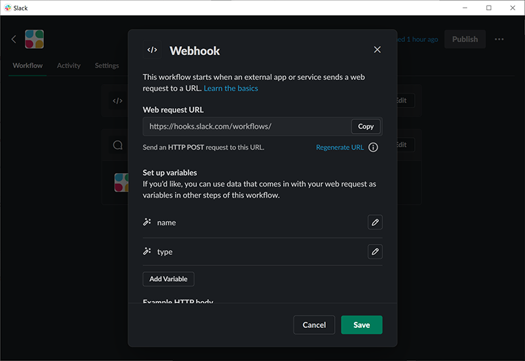
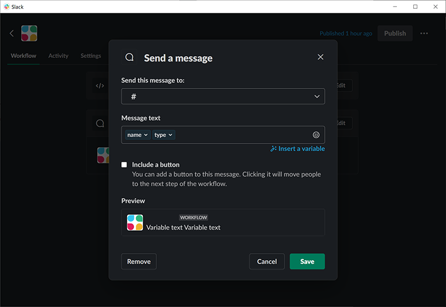

# slack-notifier

Notify Minecraft event to Slack.

Now Supported: join, leave


## Install

Download plugin from [Releases](https://github.com/amotarao/spigot-slack-notifier/releases).

Add plugin to plugins folder.


## Add Workflow on Slack

Add Workflow by Workflow Builder ([EN](https://slack.com/help/articles/360035692513-Guide-to-Workflow-Builder?utm_source=slack&utm_medium=prod&utm_campaign=hc) / [JA](https://slack.com/intl/ja-jp/help/articles/360035692513-%E3%83%AF%E3%83%BC%E3%82%AF%E3%83%95%E3%83%AD%E3%83%BC%E3%83%93%E3%83%AB%E3%83%80%E3%83%BC%E3%82%AC%E3%82%A4%E3%83%89)).

### Webhook

- Copy URL
- Add variables
  - name
  - type



### Send a message

- Set to send channel
- Set Message




## Run commands on Minecraft

Permission level is 3.

```bash
# Set URL
slack-notifier set URL # URL generated on Workflow Builder

# Get URL
slack-notifier get
```
